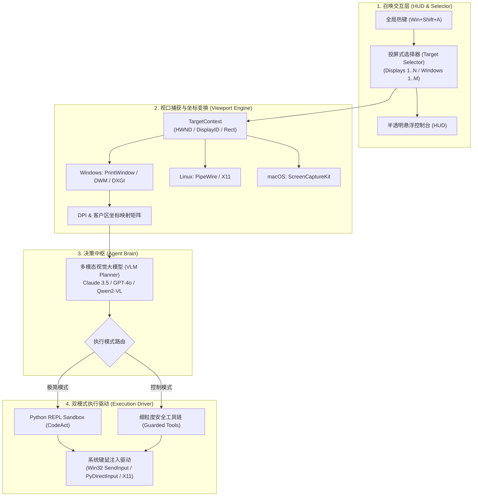

# AgentEverywhereFlow (`AEFlow`)

> **Agent on Everywhere**: Summon an autonomous GUI agent on any screen or window. 任何页面与窗口皆可一键召唤的具身智能体。

[](https://github.com/mcocdaa)
[](LICENSE)
[](pyproject.toml)
[](https://github.com/mcocdaa)

---

## 🌟 核心理念 (Core Philosophy)

现有的 Computer-Use Agent 通常存在以下痛点：
1. **全屏视口太乱**：模型容易被无关窗口、多屏坐标系偏移或后台弹窗干扰。
2. **缺乏即时召唤感**：没有像会议软件（Zoom / 腾讯会议）屏幕共享那样轻巧的选择器——自由选择**整屏（桌面1/桌面2）**还是**特定应用窗口（浏览器、IDE、微信等）**。
3. **安全与灵活性失衡**：要么死板，要么放任脚本运行导致误触。

**AgentEverywhereFlow** 旨在打破这一切：
- 🎯 **投屏式视口隔离 (Screen-Cast Picker)**：像发起屏幕共享一样，一键绑定至任何显示器或指定应用窗口，精确裁剪渲染视口与坐标系映射。
- ⚡ **即刻召唤 (Anywhere Summon)**：全局快捷键随时呼出，半透明 HUD 实时显示决策流，支持一键急停（`ESC`）。
- 🛡️ **双模式执行引擎 (Dual-Mode Execution)**：
  - **极简模式 (CodeAct)**：直接生成并运行 Python 工具调用代码，灵活高效。
  - **控制模式 (Guarded Action)**：细粒度原子级工具调用 + 敏感操作人机协同安全网。
- 🖥️ **跨平台演进路线**：Windows 优先（原生 DWM / PrintWindow 捕获 + 抗 DPI 缩放），随后平滑适配 Linux (PipeWire/X11) 与 macOS (ScreenCaptureKit)。

---

## 🏗️ 架构全景 (Architecture)



---

## 🚀 快速上手 (Quick Start)

### 安装

推荐使用现代 Python 包管理器 `uv` 进行安装：

```bash
# 克隆仓库
git clone https://github.com/mcocdaa/AgentEverywhereFlow.git
cd AgentEverywhereFlow

# 安装依赖
uv pip install -e ".[windows]"   # Windows 用户
# 或者
uv pip install -e ".[linux]"     # Linux 用户
```

### 快速启动

```bash
# 1. 启动交互式窗口选择器并召唤 Agent
aef summon

# 2. 或者在命令行直接列出当前所有可绑定的活动窗口与屏幕
aef list-targets

# 3. 指定目标窗口标题并下发任务
aef run --target "Chrome" --task "帮我在页面里搜索最近的 GitHub Trending 项目"
```

---

## 📂 项目结构 (Repository Layout)

```text
AgentEverywhereFlow/
├── pyproject.toml              # 现代包构建规范
├── README.md                   # 官方中英文档
├── agenteverywhereflow/        # 核心源码包 (CLI alias: aef)
│   ├── cli.py                  # CLI 命令集 (summon, list-targets, run)
│   ├── config.py               # 全局设置与环境配置
│   ├── capturer/               # 跨平台屏幕/窗口枚举与零拷贝捕获
│   │   ├── base.py             # 抽象基类与 TargetContext
│   │   ├── windows.py          # Windows 原生 Win32/DWM 视口捕获
│   │   ├── linux.py            # Linux X11/PipeWire 视口捕获
│   │   └── selector.py         # 交互式投屏式目标选择器
│   ├── actions/                # 底层键鼠高精度驱动与坐标映射
│   │   ├── driver.py           # 跨平台键鼠驱动
│   │   └── coords.py           # 视口像素 -> 物理屏幕坐标系投影
│   ├── engine/                 # 双模式执行中枢
│   │   ├── base.py             # 执行器接口与安全状态
│   │   ├── python_repl.py      # 极简模式: CodeAct Python 解释器
│   │   └── guarded.py          # 控制模式: 原子级动作安全门禁
│   ├── agent/                  # VLM 提示词与循环流 (Observe-Plan-Act)
│   │   ├── loop.py             # 具身智能体生命周期中枢
│   │   └── prompts.py          # 视口具身提示词
│   └── safety/                 # 安全策略拦截器 (Human-in-the-loop)
│       └── policy.py           # 敏感行为规则过滤器
└── tests/                      # 单元与集成测试
```

---

## 🗺️ 路线图 (Roadmap)

- [x] **v0.1.0 (MVP 阶段)**：
  - [x] 跨平台视口抽象：显示器全屏与独立窗口枚举。
  - [x] Windows 原生窗口捕获与 DPI 映射。
  - [x] 双模式执行引擎基座（极简 Python REPL 模式 + 细粒度控制模式）。
  - [x] 命令行投屏式选择与交互（`aef summon`）。
- [ ] **v0.2.0 (HUD 沉浸交互)**：
  - [ ] 基于轻量级半透明浮窗的召唤 HUD。
  - [ ] 全局热键唤起与 ESC 一键急停刹车。
- [ ] **v0.3.0 (跨系统扩展)**：
  - [ ] Linux Wayland / PipeWire 深度适配。
  - [ ] macOS ScreenCaptureKit 视口集成。

---

## 📄 开源许可证

本项目采用 [MIT 许可证](LICENSE)。
