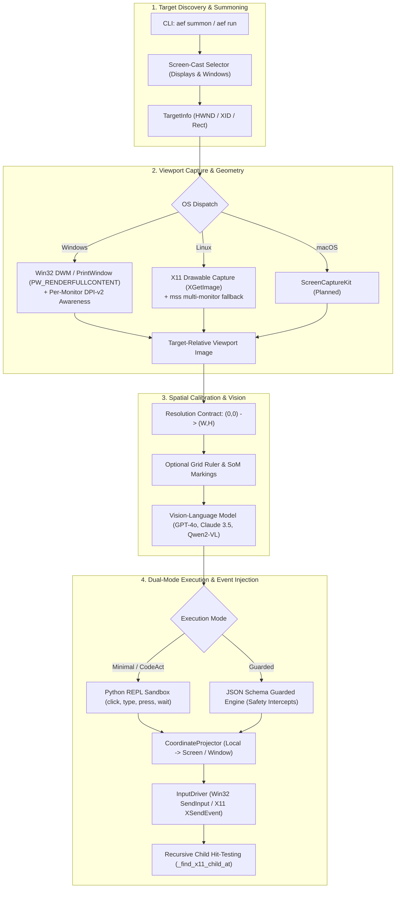

<div align="center">

# 🌐 AgentEverywhereFlow (`AEFlow`)

**Agent on Everywhere**: Instant screen & window casting for embodied desktop agents.  
任何页面与窗口皆可一键投屏召唤的具身智能体基础设施。

[](https://github.com/mcocdaa)
[](https://github.com/mcocdaa/AgentEverywhereFlow/actions)
[](LICENSE)
[](pyproject.toml)
[](https://github.com/astral-sh/ruff)
[](CONTRIBUTING.md)

[English](README.md) | [简体中文](README_CN.md)

</div>

---

## 💡 Why AgentEverywhereFlow?

Existing computer-use and GUI automation agents suffer from three major roadblocks:
1. **Unfocused Global Viewports**: Grabbing the entire desktop leads to visual noise, popup interference, and negative/distorted coordinates across multiple monitors.
2. **Lack of Instant Targeting**: There is no lightweight experience akin to Zoom / Tencent Meeting screen-sharing—allowing users to freely cast either an **entire monitor** or a **specific application window** (VS Code, Chrome, Terminal, etc.) to the agent.
3. **Execution Rigidity vs. Safety**: Either agents are constrained to sluggish step-by-step clicks or given unconstrained bash access that risks destructive missteps.

**AgentEverywhereFlow (AEFlow)** solves this by introducing **Screen-Cast Style Viewport Isolation** for autonomous GUI agents:
- 🎯 **Screen-Cast Target Picker**: Discover and bind agents to any physical display or active application window with zero-copy capture and precise viewport coordinate projection.
- ⚡ **Instant Summon (`aef summon`)**: Cast and summon an agent in seconds via an interactive terminal UI or global shortcut.
- 📐 **Explicit Resolution Contract**: Native pixel-space calibration `(0, 0) -> (width, height)` paired with optional coordinate grids and Set-of-Mark (SoM) indicators.
- 🛡️ **Dual-Mode Execution Architecture**:
  - **Minimal Mode (CodeAct REPL)**: High-speed, pythonic chaining of actions (`click`, `type_text`, `press`, `wait`, `hotkey`).
  - **Guarded Mode (JSON Schema)**: Strict atomic action schemas with safety policy filters and human-in-the-loop confirmation gates.
- 🎯 **Recursive Sub-Widget Hit Testing**: Deep X11 and Win32 tree inspection ensuring clicks reliably trigger nested buttons, inputs, and controls without event dropping.

---

## 🏗️ Architecture Blueprint



---

## ⚖️ Dual-Mode Execution Comparison

| Feature | ⚡ Minimal Mode (CodeAct REPL) | 🛡️ Guarded Mode (Structured JSON) |
| :--- | :--- | :--- |
| **Protocol** | Python code block (```python ... ```) | JSON Schema (```json ... ```) |
| **API** | `click(x, y)`, `type_text()`, `press()`, `wait()` | `{"action": "click", "x": 100, "y": 200}` |
| **Throughput** | High (multi-action chaining in single LLM turn) | Deterministic (strict atomic step verification) |
| **Safety Net** | Restricted sandbox built-ins | Policy interceptors & Human confirmation prompts |
| **Best For** | Prototyping, web browsing, form filling | Financial operations, sensitive infrastructure, production |

---

## ⚡ Quick Start

### Installation

AEFlow is built using modern Python packaging with [`uv`](https://github.com/astral-sh/uv):

```bash
# Clone the repository
git clone https://github.com/mcocdaa/AgentEverywhereFlow.git
cd AgentEverywhereFlow

# Install dependencies based on your operating system
# On Linux:
uv pip install -e ".[linux]"

# On Windows:
uv pip install -e ".[windows]"

# Developer / Contributor setup:
uv pip install -e ".[dev,linux]"
```

### Configuration

Copy the template environment file and add your model provider credentials:

```bash
cp .env.example .env
```

Key environment variables in `.env`:
```ini
AEF_MODEL_NAME=gpt-4o
AEF_API_KEY=your_api_key_here
AEF_BASE_URL=https://api.openai.com/v1
AEF_DEFAULT_MODE=minimal
```

---

## 🕹️ CLI Usage

```bash
# 1. Interactive screen-cast target picker and agent summoner
aef summon

# 2. List all available physical displays and active application windows
aef list-targets

# 3. Directly summon agent onto a matching display or window title
aef run --target "Chrome" --task "Search for GitHub Trending repositories"

# 4. Check system info & installed version
aef version
```

---

## 💻 Programmatic Usage

You can embed AEFlow directly into your Python workflows:

```python
from agenteverywhereflow.capturer import get_capturer
from agenteverywhereflow.agent.loop import AgentLoop
from agenteverywhereflow.config import AppConfig, ExecutionMode

# 1. Discover target windows
capturer = get_capturer()
targets = capturer.list_targets()
target = targets[0]  # E.g. VS Code, Terminal, or Display 1

# 2. Initialize Agent Loop
loop = AgentLoop(app_config=AppConfig(default_mode=ExecutionMode.MINIMAL_PYTHON))

# 3. Run autonomous task
loop.run(target=target, user_task="Fill the form and click submit")
```

See [examples/](examples/) for more scripts, including custom model planner callbacks.

---

## 🧪 Comprehensive Benchmarks

AEFlow includes a high-fidelity end-to-end benchmark suite testing real GUI windows and multi-step agent actions:

```bash
# Run comprehensive multi-scenario suite (Form, Calculator, Guarded Mode)
uv run python -m benchmarks.bench_suite

# Run autonomous goal convergence benchmark
uv run python -m benchmarks.bench_autonomous

# Run standard unit tests
uv run pytest tests/ -v
```

See [benchmarks/README.md](benchmarks/README.md) for benchmark specifications and results.

---

## 📂 Repository Layout

```text
AgentEverywhereFlow/
├── .github/                    # CI/CD workflows, issue templates, dependabot
├── agenteverywhereflow/        # Core package (CLI: aef)
│   ├── actions/                # InputDriver & CoordinateProjector
│   ├── agent/                  # AgentLoop, Prompts & VisionPipeline (SoM)
│   ├── capturer/               # Win32, X11 & interactive TargetSelector
│   ├── engine/                 # Minimal (CodeAct REPL) & Guarded engines
│   ├── cli.py                  # Typer CLI application
│   └── config.py               # Pydantic v2 application configuration
├── benchmarks/                 # Multi-scenario autonomous benchmark suite
├── docs/                       # Architecture, vision pipeline, and engine docs
├── examples/                   # Developer invocation examples
├── tests/                      # Unit tests (pytest)
├── pyproject.toml              # Build & dependency declarations
├── CONTRIBUTING.md             # Developer contribution guide
├── SECURITY.md                 # Security reporting policy
├── AGENTS.md                   # AI Coding Agent invariants & guidelines
└── CHANGELOG.md                # Release version history
```

---

## 🗺️ Roadmap

- [x] **v0.1.0 (MVP Foundation)**:
  - [x] Viewport abstractions: Display & Window enumeration.
  - [x] Windows native DWM / `PrintWindow` capture with Per-Monitor DPI-v2 awareness.
  - [x] Linux X11 native drawable window capture & child hit-testing (`_find_x11_child_at`).
  - [x] Dual-mode execution engines (CodeAct REPL & Guarded Action Engine).
  - [x] End-to-end benchmark suite (Form, Calculator, Guarded).
- [ ] **v0.2.0 (Interactive HUD)**:
  - [ ] Transparent floating HUD showing real-time agent reasoning steps.
  - [ ] Global hotkey summoning (`Win+Shift+A` / `Ctrl+Shift+A`) and instant emergency stop (`ESC`).
- [ ] **v0.3.0 (Ecosystem Expansion)**:
  - [ ] Linux Wayland / PipeWire portal integration.
  - [ ] macOS ScreenCaptureKit integration.

---

## 🤝 Contributing

Contributions are welcome! Please read [CONTRIBUTING.md](CONTRIBUTING.md) and [AGENTS.md](AGENTS.md) before submitting pull requests.

---

## 📄 License

This project is licensed under the [MIT License](LICENSE).
