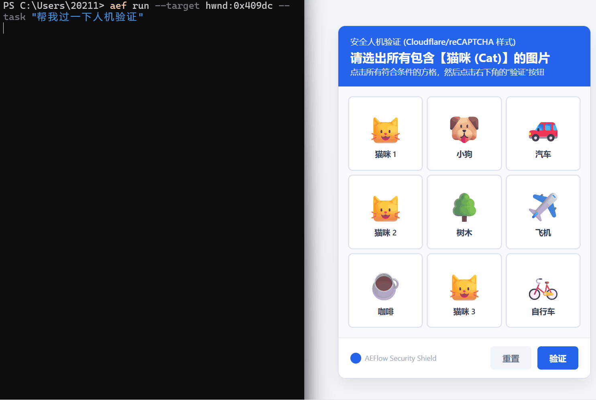
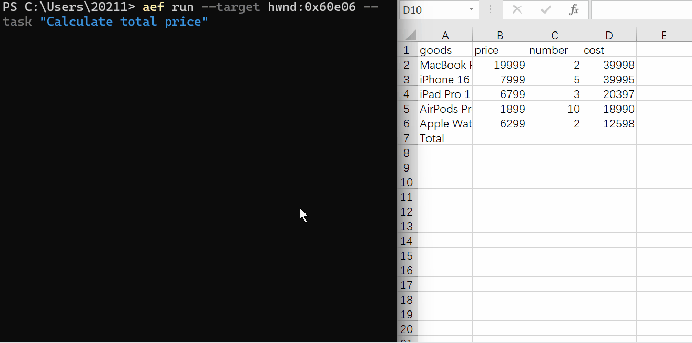
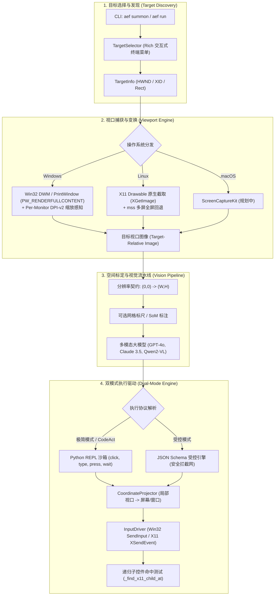

<div align="center">

# 🌐 AgentEverywhereFlow (`AEFlow`)

**Agent on Everywhere**: 任何页面与窗口皆可一键投屏召唤的具身桌面智能体基础设施。

[](https://github.com/mcocdaa)
[](https://github.com/mcocdaa/AgentEverywhereFlow/actions)
[](LICENSE)
[](pyproject.toml)
[](https://github.com/astral-sh/ruff)
[](CONTRIBUTING.md)

[English](README.md) | [简体中文](README_CN.md)

</div>

---

<div align="center">

### 🎬 真实场景自动化演示 (Real-World Demos)

#### 🐱 场景 1：浏览器多模态空间感知与九宫格人机验证破解


*零样本视觉空间定位：Agent 投屏绑定浏览器窗口，毫秒级理解九宫格任务要求，精准辨识 3 张猫咪图片依次点击打勾，并点击右下角按钮通过人机验证。*

```bash
# 在 Chrome 或 Edge 浏览器中即刻复现（使用内置 examples/captcha_demo.html）:
aef run --target "Chrome" --task "在当前九宫格人机验证中，找出所有包含猫咪的方格依次点击选中，然后点击右下角的验证按钮"
```

<br/>

#### 📊 场景 2：桌面办公自动化与 Excel 表格公式自动求和


*桌面生产力闭环：Agent 投屏绑定 Excel 窗口，自动定位销售额列下方的空白总计单元格，注入 <code>=SUM(D2:D6)</code> 公式并敲下回车完成统计。*

```bash
# 在 Excel 或 WPS 中即刻复现（使用内置 examples/sales_demo.xlsx）:
aef run --target "Excel" --task "在销售额列下方的总计空白单元格点击，输入求和公式计算总金额并按回车"
```

</div>

## 💡 为什么需要 AgentEverywhereFlow？

现有的计算机操作智能体（Computer-Use Agent）通常存在三大痛点：
1. **全屏视口干扰严重**：直接获取全局桌面截屏会引入无关后台窗口、系统弹窗的视觉噪音，多显示器拼接时还常出现负坐标与高分屏缩放畸变。
2. **缺乏即时精准的投屏体验**：没有类似腾讯会议或 Zoom“屏幕共享”那样轻快的体验——让用户可以随时自由选择**整屏（显示器1/显示器2）**或**特定应用窗口（浏览器、IDE、微信、终端等）**一键投送给 Agent。
3. **灵活性与安全性失衡**：要么被限制在死板的单步点击中，延迟高且吞吐低；要么放任执行底层命令，缺乏必要的安全围栏。

**AgentEverywhereFlow (AEFlow)** 引入了全新的**投屏式视口隔离 (Screen-Cast Viewport Isolation)** 架构：
- 🎯 **投屏式视口隔离 (Screen-Cast Picker)**：像发起会议投屏一样，一键绑定至任意物理显示器或指定应用窗口，精确裁剪渲染视口与数学坐标投影。
- ⚡ **即刻召唤 (`aef summon`)**：支持终端交互式菜单与全局热键秒级唤起。
- 📐 **严格空间分辨率契约**：明确视口像素空间 `(0, 0) -> (width, height)`，支持坐标网格辅助标尺与 Set-of-Mark (SoM) 候选标定。
- 🛡️ **双模式执行引擎架构**：
  - **极简模式 (CodeAct REPL)**：支持模型直接生成并链式执行 Python 工具代码（`click`, `type_text`, `press`, `wait`），支持多代码块序列合并执行。
  - **受控模式 (Guarded Action Engine)**：严格 JSON Schema 原子级操作分发，提供敏感行为拦截与人机确认门禁。
- 🎯 **递归子组件命中测试**：针对 X11 与 Win32 树状层级，自动递归查找最底层子控件 XID/HWND，保证按钮与输入框 100% 响应事件。

---

## 🏗️ 架构全景



---

## ⚖️ 双模式执行引擎对比

| 维度 | ⚡ 极简模式 (CodeAct REPL) | 🛡️ 受控模式 (Guarded Action Engine) |
| :--- | :--- | :--- |
| **交互协议** | Markdown Python 代码块 (```python ... ```) | 严格 JSON Schema (```json ... ```) |
| **主要接口** | `click(x, y)`, `type_text()`, `press()`, `wait()` | `{"action": "click", "x": 100, "y": 200}` |
| **执行效率** | 极高（单轮对话中直接完成多步链式操作） | 确定（严格逐动作用例流转与检查） |
| **安全机制** | 限制内置函数，禁用危险 `os`/`sys` 挂钩 | 敏感动作拦截器、人机确认门禁 (`require_human_confirmation`) |
| **推荐场景** | 快速原型验证、网页信息搜集、常规表单填写 | 金融交易、企业核心办公系统、敏感生产环境 |

---

## ⚡ 快速上手

### 安装

推荐使用现代极速包管理器 [`uv`](https://github.com/astral-sh/uv) 安装：

```bash
# 克隆代码仓库
git clone https://github.com/mcocdaa/AgentEverywhereFlow.git
cd AgentEverywhereFlow

# 根据操作系统安装对应依赖
# Linux 用户:
uv pip install -e ".[linux]"

# Windows 用户:
uv pip install -e ".[windows]"

# 开发者全量环境:
uv pip install -e ".[dev,linux]"
```

### 环境配置

AEFlow 支持多种便捷配置方式并具备多层级自动回退机制（默认模型：`deepseek-flash` | 默认 Base URL：`https://api.deepseek.com`）：

#### 方式 1：CLI 一键配置（推荐）
免手动编辑文件，自动持久化至全局 `~/.aef/.env`：
```bash
# 1. 设置 API Key（系统开箱已预设为 DeepSeek）：
aef config --set-key "sk-your-api-key"

# 2. （可选）随时切换为 OpenAI、Claude 或自定义模型：
aef config --set-model "gpt-4o"
aef config --set-base "https://api.openai.com/v1"
```

#### 方式 2：标准环境变量识别
AEFlow 会自动读取系统标准环境变量：
```bash
export OPENAI_API_KEY="sk-your-api-key"

# 可选覆盖项（开箱默认即为 https://api.deepseek.com 与 deepseek-flash）：
export OPENAI_BASE_URL="https://api.deepseek.com"
export OPENAI_MODEL_NAME="deepseek-flash"
```

#### 方式 3：本地项目级 `.env`
也可以在当前工作目录下放置 `.env` 文件：
```ini
AEF_MODEL_NAME=deepseek-flash
AEF_BASE_URL=https://api.deepseek.com
AEF_API_KEY=your_api_key_here
AEF_DEFAULT_MODE=minimal
```

---

## 🕹️ CLI 常用命令

```bash
# 1. 启动交互式投屏目标选择器并召唤智能体
aef summon

# 2. 列出当前可用物理显示器与应用窗口（带 Target ID 与 HWND 句柄）
aef list-targets

# 3. 按窗口标题关键字匹配召唤
aef run --target "Chrome" --task "帮我在页面里搜索最近的 GitHub Trending 项目"

# 4. 按 Target ID 或 16进制 HWND 精确召唤（杜绝窗口同名歧义）
aef run --target hwnd:0x409dc --task "帮我过一下人机验证"

# 5. 直接投屏整个物理显示器
aef run --target display:1 --task "整理桌面图标并排列窗口"

# 6. 开启 Debug 诊断模式运行（打印实时 Token 消耗、状态诊断与逐步截图）
aef run --target "Excel" --task "计算总金额" --debug

# 7. 查看当前生效的完整配置
aef config

# 8. 查看系统信息与已安装版本
aef version
```

---

## 💻 代码中调用 (Python API)

你可以方便地将 AEFlow 嵌入进自己的自动化工作流中：

```python
from agenteverywhereflow.capturer import get_capturer
from agenteverywhereflow.agent.loop import AgentLoop
from agenteverywhereflow.config import AppConfig, ExecutionMode

# 1. 发现系统活动目标
capturer = get_capturer()
targets = capturer.list_targets()
target = targets[0]  # 例如 VS Code、终端窗口或显示器 1

# 2. 初始化智能体循环
loop = AgentLoop(app_config=AppConfig(default_mode=ExecutionMode.MINIMAL_PYTHON))

# 3. 运行端到端任务
loop.run(target=target, user_task="录入表单数据并点击提交按钮")
```

更多进阶用法、自定义规划器回调与演示测试资产请参阅 [examples/](examples/) 目录。

---

## 🧪 自动化基准测试集

AEFlow 内置了基于真实桌面 GUI 窗口的高保真端到端基准测试：

```bash
# 运行三合一综合场景基准测试（企业表单、紧凑计算器、受控模式）
uv run python -m benchmarks.bench_suite

# 运行单用例自主目标收敛测试
uv run python -m benchmarks.bench_autonomous

# 运行标准单元测试
uv run pytest tests/ -v
```

更多测试细节与产物说明请参阅 [benchmarks/README.md](benchmarks/README.md)。

---

## 📂 项目结构全景

```text
AgentEverywhereFlow/
├── .github/                    # CI/CD 工作流、Issue/PR 模板、Dependabot
├── agenteverywhereflow/        # 核心源码包 (CLI: aef)
│   ├── actions/                # 底层驱动 (driver.py) 与坐标投影 (coords.py)
│   ├── agent/                  # 智能体中枢 (loop.py)、提示词与视觉管线 (vision.py)
│   ├── capturer/               # Win32, X11 零拷贝捕获器与 TargetSelector
│   ├── engine/                 # 极简模式 (CodeAct) 与受控模式执行引擎
│   ├── cli.py                  # Typer 终端命令行入口
│   └── config.py               # Pydantic v2 配置模型
├── benchmarks/                 # 自动化端到端高保真基准测试集
├── docs/                       # 核心架构、视觉标定与执行引擎详细文档
├── examples/                   # 开发者 Python 调用示例与互动演示资产
├── tests/                      # 单元测试 (pytest)
├── pyproject.toml              # 现代包构建规范
├── CONTRIBUTING.md             # 开发者贡献指南
├── SECURITY.md                 # 安全策略与漏洞通报
├── AGENTS.md                   # 面向 AI Coding Agent 的操作指南
└── CHANGELOG.md                # 版本演进日志
```

---

## 🗺️ 演进路线图 (Roadmap)

- [x] **v0.1.0 ~ v0.1.3 (核心基座与体验加固)**:
  - [x] 跨平台视口抽象：显示器全屏与独立窗口枚举，支持 Target ID 精准定位。
  - [x] Windows 原生 DWM / `PrintWindow` 捕获与 Per-Monitor DPI-v2 缩放支持。
  - [x] Linux X11 独立 Drawable 原生捕获与递归子组件事件分发 (`_find_x11_child_at`)。
  - [x] 硬件级 Win32 鼠标点击注入、前台输入锁穿透与剪贴板中文防输入法拦截输入。
  - [x] 双模式执行引擎基座（极简 Python CodeAct REPL + 细粒度受控模式）。
  - [x] 多代码块 CodeAct 序列自动合并执行与终端 ANSI 输出隔离。
  - [x] 全局 `~/.aef/.env` 级联配置系统与 `aef config` 交互命令。
  - [x] 端到端高保真基准测试套件（表单、计算器、受控模式）与真实动效展示。
- [ ] **v0.2.0 (交互式 HUD)**:
  - [ ] 基于轻量级半透明浮窗的智能体状态与思考流 HUD。
  - [ ] 全局快捷键呼出 (`Win+Shift+A` / `Ctrl+Shift+A`) 与一键急停刹车 (`ESC`)。
- [ ] **v0.3.0 (跨平台深化)**:
  - [ ] Linux Wayland / PipeWire portal 原生集成。
  - [ ] macOS ScreenCaptureKit 视口集成。

---

## 🤝 参与贡献

欢迎提出任何改进建议或提交 PR！提交前请查阅 [CONTRIBUTING.md](CONTRIBUTING.md) 与 [AGENTS.md](AGENTS.md)。

---

## 📄 开源许可证

本项目采用 [MIT 许可证](LICENSE)。
