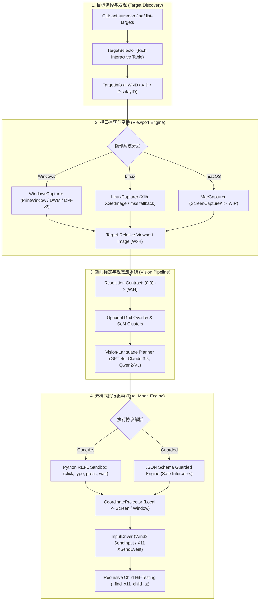

# AEFlow 核心架构设计 (Architecture Blueprint)

## 1. 设计初衷与生态定位

现有的多模态计算机控制智能体（Computer-Use Agent）普遍直接基于操作系统的主屏幕进行全屏截屏与绝对坐标注入。这种方式在以下场景中遇到严重阻碍：
- **多显示器环境**：坐标系跨越主副屏时出现负坐标或缩放失真；
- **后台窗口遮挡**：模型关注的目标窗口容易被弹窗、侧边栏或无关窗口遮挡；
- **操作漂移**：缺少类似会议投屏的“选择分享屏幕/窗口”能力，导致 Agent 的注意力被全局无关信息分散。

**AgentEverywhereFlow (AEFlow)** 将会议软件的“投屏共享（Screen-Cast Sharing）”理念引入具身智能体领域。  
其核心公式为：
$$\text{Embodied Target} = \text{TargetInfo}(\text{TargetType}, \text{NativeHandle}, \text{Rect}) \otimes \text{Viewport Transform}$$

---

## 2. 总体架构分层



---

## 3. 关键子系统详解

### 3.1 视口捕获与发现引擎 (`capturer/`)
- **Windows 原生 DWM / PrintWindow 机制**：
  - 调用 `win32gui.GetWindowRect` 与 DWM 属性 `DWMWA_EXTENDED_FRAME_BOUNDS`，过滤掉系统隐形窗口（`DWMWA_CLOAKED`）与空标题句柄；
  - 针对 Windows 10/11，默认采用 `PW_RENDERFULLCONTENT` 标志执行 `PrintWindow`，无需将目标窗口强制拉到顶层即可获取清晰的后台独立渲染内容。
  - 原生支持 **Per-Monitor DPI Aware v2**，规避高分屏（125%、150%、200%）下的缩放模糊与像素位置偏斜。
- **Linux X11 原生 Drawable 机制**：
  - 通过 `python-xlib` 的 `display.create_resource_object("window", wid)` 直接调用 X11 协议获取指定窗口的图像数据 (`get_image`)；
  - 绕过了在现代 rootless XWayland / WSLg 架构下截取 Root Window 返回黑屏或 `-32768` 异常坐标的底层限制。

### 3.2 递归控件命中测试 (`actions/driver.py`)
在 Linux X11 体系中，直接向顶层主窗口句柄发送 `ButtonPress`/`ButtonRelease` 事件时，若主窗口未显式向子组件传播事件，输入通常会被静默丢弃。  
AEFlow 实现了基于 X11 树状结构的深度递归命中检测算法：

```python
def _find_x11_child_at(self, d, parent_win, rel_x: int, rel_y: int):
    # 逐层向下递归 query_tree，计算相对 offset，准确定位接收鼠标事件的最底层子控件 XID
    ...
```
该机制保证了对于 Tkinter、Qt、GTK 或复杂原生窗口中的按钮、输入框、复选框等子控件，事件能 100% 被目标组件接收。

### 3.3 视口几何投影 (`actions/coords.py`)
`CoordinateProjector` 建立局部视口坐标到操作系统全局坐标的数学映射：
- 对于 `DISPLAY` 目标：
  $$X_{\text{screen}} = X_{\text{display}} + x_{\text{local}}, \quad Y_{\text{screen}} = Y_{\text{display}} + y_{\text{local}}$$
- 对于 `WINDOW` 目标：
  支持直接将局部偏移量 `(x, y)` 传递给窗口专属事件驱动，或者投影为全局绝对像素点以驱动通用的底层驱动。
