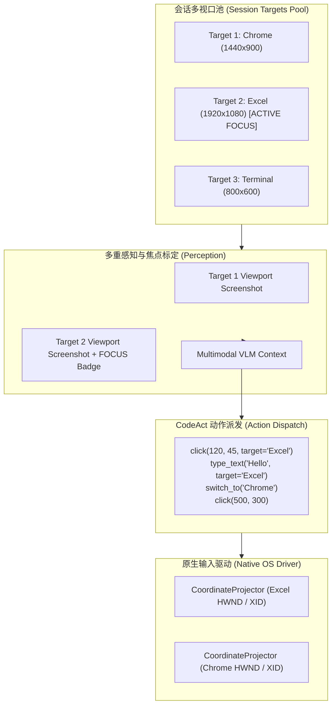

# 跨窗口协同与工作流回放引擎指南 (Multi-Target Coordination & Workflow Replay)

本文档面向需要在多个应用窗口间进行协同操作，或需要录制会话动作并以**零模型 API 开销**进行确定性重放的用户与开发者。

---

## 1. 跨窗口协同机制 (Multi-Target Cross-App Coordination)

在真实的桌面办公与自动化场景中，任务往往涉及跨多个应用窗口的操作（例如：在浏览器中查阅资料，并将结果复制填写到 Excel 表格或飞书/微信聊天框中）。

### 1.1 协同架构设计



### 1.2 启动与管理多窗口会话

通过命令行一次性绑定多个窗口：

```bash
# 启动绑定 Chrome 和 Excel 的交互式会话
aef chat -t "Chrome" -t "Excel"

# 或者使用逗号分隔简写
aef chat -t "Chrome,Excel"
```

### 1.3 会话内交互式窗口控制命令

在 `aef chat` 交互式会话提示符下，可随时使用 `/target` 指令管理窗口池：

| 命令 | 功能说明 | 示例 |
| :--- | :--- | :--- |
| `/targets` 或 `/target list` | 列出当前会话绑定的所有窗口信息及焦点状态 | `/targets` |
| `/target add <query>` | 动态查找并将新窗口加入会话池 | `/target add "VS Code"` |
| `/target remove <query>` | 从会话池中移除特定窗口 | `/target remove "Excel"` |
| `/target switch <query>` | 切换当前活跃操作视口 | `/target switch "Chrome"` |

### 1.4 CodeAct 中的多窗口动作语法

在 Minimal Mode 中，VLM 可以自由编写原生多窗口协同代码：

```python
# 1. 在活跃视口中操作
click(240, 180)
type_text("Annual Sales Data")

# 2. 定向在指定目标视口中操作（无需切换全局焦点）
click(500, 320, target="Chrome")
hotkey("ctrl", "c", target="Chrome")

# 3. 显式切换活跃窗口
switch_to("Excel")
click(100, 200)
hotkey("ctrl", "v")
```

---

## 2. 工作流录制与零 LLM 确定性重放 (Workflow Replay Engine)

在探索性对话中，模型可能经过多次视口感知与多轮推理完成复杂任务。一旦验证成功，用户通常希望在今后无需再耗费 API Token，直接以最快速度重复执行相同的操作轨迹。

### 2.1 录制与导出机制

在会话执行期间，每一次经安全校验并成功执行的动作（不管是 CodeAct 代码块还是 Guarded JSON 动作）均会被 `WorkflowRecorder` 自动收录。

在交互式会话中输入：
```text
/export sales_pipeline.py
# 或
/export sales_pipeline.yaml
```
文件将自动保存至 `~/.aef/workflows/` 目录下。

### 2.2 导出产物规格

#### A. 独立原生 Python 自动化脚本 (`.py`)
- **0 依赖 LLM**：完全免调用 OpenAI / Claude / DeepSeek API。
- **动态视口绑定**：内嵌目标窗口自适应查找与坐标变换投影，即使每次启动时窗口位置发生改变，亦能精准命中目标坐标。
- **独立可分发**：只需安装 `agenteverywhereflow`，即可在任何机器（本地、服务器、CI 流水线）中通过 `python sales_pipeline.py` 直接运行。

#### B. 声明式 YAML 工作流 (`.yaml`)
规范清晰记录操作序列，易于与 CI/CD 流水线集成：
```yaml
version: "1.0"
name: "Exported Workflow - Chrome"
created_at: 1727610000.0
targets:
  - target_id: "window:0x3400012"
    title: "Google Chrome"
    rect: { x: 100, y: 80, width: 1400, height: 900 }
steps:
  - step: 1
    action: click
    params: { x: 450, y: 180 }
    target_id: "window:0x3400012"
  - step: 2
    action: type_text
    params: { text: "pytest" }
    target_id: "window:0x3400012"
  - step: 3
    action: press
    params: { key: "Return" }
    target_id: "window:0x3400012"
```

### 2.3 无头确定性回放运行器 (`aef workflow play`)

使用内置回放命令执行导出的 YAML 工作流：

```bash
# 标准速度重放工作流
aef workflow play ~/.aef/workflows/sales_pipeline.yaml

# 2.0 倍速快速回放
aef workflow play ~/.aef/workflows/sales_pipeline.yaml --speed 2.0

# 演练模式（Dry Run，仅打印解析的物理屏幕绝对坐标，不注入实际物理键鼠）
aef workflow play ~/.aef/workflows/sales_pipeline.yaml --dry-run
```
