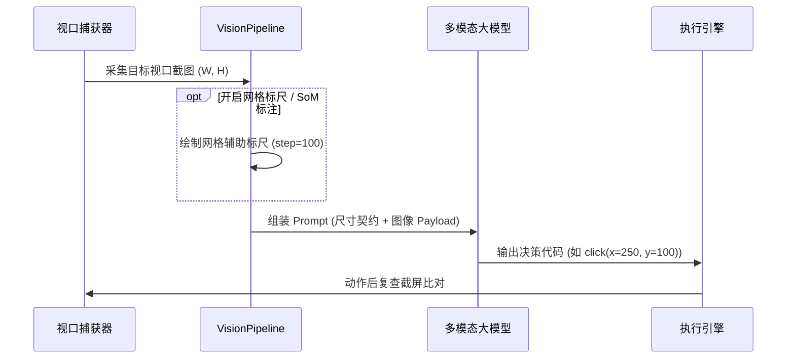

# 视觉管线与空间标定契约 (Vision Pipeline & Spatial Calibration)

## 1. 核心视觉理念：分辨率契约 (Resolution Contract)

许多早期的 GUI Agent 试图在本地利用 OpenCV、Canny 边缘检测、OCR 文本框探测等传统计算机视觉算子为每个控件计算包围盒（Bounding Box）。然而在真实复杂的桌面 UI 中，扁平化设计、无边框按钮、SVG 图标与复杂渐变往往会导致传统算法频繁误检或漏检。

**AEFlow** 坚持现代具身智能设计原则：
1. **信任最强 VLM 的原生像素感知**：现代多模态大模型（GPT-4o、Claude 3.5 Sonnet、Qwen2-VL）已经在数以亿计的高清网页和桌面截屏中完成了像素级预训练，天然理解坐标空间。
2. **严守空间分辨率契约 (Explicit Resolution Contract)**：
   每次向 VLM 传递截图时，严格随附当前视口的原生几何元数据：
   - 视口总宽高：`width` $\times$ `height`
   - 原点：左上角 `(0, 0)`
   - 范围边界：右下角 `(width, height)`
   - 格式声明：所有代码调用的坐标必须以该视口为基准像素单位。

---

## 2. 增强视觉标尺体系 (`agent/vision.py`)

在面对高密度数据表格、精细 CAD 工具栏或小型密集按钮矩阵时，模型偶尔可能产生轻微的像素预测偏差。为此，AEFlow 提供了可插拔的两种视觉辅助层：

### 2.1 坐标网格辅助标尺 (Coordinate Grid Overlay)
通过 `VisionPipeline.draw_grid_overlay(image, step=100)`：
- 在原图上绘制半透明浅色网格线；
- 在每条网格交汇处标注精确像素坐标数值（例如 `(100, 200)`、`(200, 200)` 等）；
- 为模型提供直观的空间参考坐标轴，使点击误差降低至零。

### 2.2 Set-of-Mark (SoM) 聚类标识
通过 `VisionPipeline.detect_som_candidates(image)`：
- 快速聚类高对比度与轮廓分明的 UI 交互热区；
- 绘制醒目的数字编号矩形框（`1`, `2`, `3`, ...）；
- 支持模型通过 `click_mark(3)` 或直接读取标定数字进行交互。

---

## 3. 视觉生命周期图示

