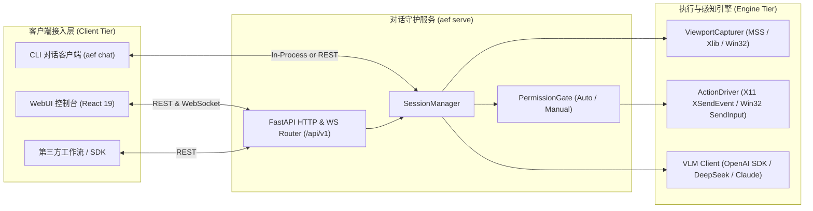

# WebUI 与远程集成架构指南 (WebUI & Integration Guide)

本文档面向接入 **AgentEverywhereFlow (AEFlow)** 服务的客户端开发者（包括 Web 前端、桌面外壳、自动化测试系统等）。

---

## 1. 核心架构契约 (Architecture Invariants)

AgentEverywhereFlow 坚持 **"无头核心 (Headless Core) + 独立客户端 (Decoupled Clients)"** 的架构分离设计：

- **核心后端 (`agenteverywhereflow`)**：
  - 极致轻量、零 GUI 重型依赖（无 Qt、无 Electron、无 Node 环境）。
  - 基于 FastAPI + Uvicorn 提供 REST API 与全双工 WebSocket 服务。
  - 核心职责：跨平台视口捕获、局部与物理坐标变换、VLM 循环推理、原生键鼠事件注入、权限安全门禁与会话状态落盘。
- **独立控制台前端 (`AgentEverywhereFlow-WebUI`)**：
  - 独立代码仓库：[`mcocdaa/AgentEverywhereFlow-WebUI`](https://github.com/mcocdaa/AgentEverywhereFlow-WebUI)。
  - 基于 React 19 + TypeScript + Vite + Tailwind CSS v4 打造的现代 SPA。
  - 任意平台（Linux / macOS / Windows / 移动平板）浏览器直开，零配置即连。



---

## 2. 启动服务与端口说明

在任意运行 AEFlow 的主机上，执行以下命令拉起服务守护进程：

```bash
# 启动对话服务守护进程（默认监听 127.0.0.1:8000）
uv run aef serve --host 127.0.0.1 --port 8000

# 查看完整 Swagger / OpenAPI 交互式文档
# 打开浏览器访问: http://127.0.0.1:8000/docs
```

---

## 3. REST API 规格速查

基础 URL: `http://127.0.0.1:8000/api/v1`

### 3.1 基础与健康探测
- **`GET /health`**
  - **响应**：`{"status": "ok", "version": "0.1.5", "active_sessions": 1}`
  - **说明**：用于检测后端服务在线状态与已安装版本。

### 3.2 目标视口探测 (Target Discovery)
- **`GET /targets`**
  - **查询参数**：
    - `displays_only: bool`（仅列出物理显示器）
    - `windows_only: bool`（仅列出应用窗口）
  - **响应示例**：
    ```json
    [
      {
        "target_id": "window:0x3400012",
        "target_type": "window",
        "title": "Google Chrome - GitHub",
        "native_handle": 54525970,
        "process_name": "chrome",
        "is_minimized": false,
        "rect": { "x": 100, "y": 80, "width": 1400, "height": 900 }
      }
    ]
    ```

### 3.3 会话生命周期管理 (Session Lifecycle)
- **`POST /sessions`**
  - **请求体**：
    ```json
    {
      "target_id": "window:0x3400012",
      "mode": "minimal_python",
      "permission_mode": "auto",
      "session_id": null
    }
    ```
  - **响应**：返回创建完成的 `session_id`、绑定目标视口元数据与初始生命周期状态。
- **`GET /sessions`**：列出所有活跃会话列表及各会话当前状态。
- **`GET /sessions/{session_id}`**：获取会话详细状态，包括当前是否处在等待人工审批状态（`pending_approval`）。
- **`POST /sessions/{session_id}/reset`**：清除当前会话历史上下文（保留视口绑定）。
- **`DELETE /sessions/{session_id}`**：安全关闭会话并清理临时资源。

### 3.4 交互与指令执行
- **`POST /sessions/{session_id}/message`**
  - **请求体**：
    ```json
    {
      "instruction": "点击右上角设置图标并切换到深色模式",
      "max_steps": 50,
      "async_execution": true
    }
    ```
  - **说明**：向智能体发送任务指令。推荐将 `async_execution` 设为 `true`，通过 WebSocket 接收流式执行轨迹。

### 3.5 实时视口截图 (Viewport Frame)
- **`GET /sessions/{session_id}/screenshot`**
  - **响应**：直接返回 `image/jpeg` 二进制流（质量 85，严格隔离目标窗口，无桌面杂质）。
  - **前端刷新机制**：前端可通过动态添加时间戳参数（如 `?t=1695990000`）实现轮询刷新或监听 WebSocket 事件按需刷新。

### 3.6 人工介入权限门禁 (Human-in-the-Loop)
- **`GET /sessions/{session_id}/approval`**：获取当前待审批的动作详情。
- **`POST /sessions/{session_id}/approval`**
  - **请求体**：
    ```json
    {
      "approved": true,
      "reason": "已核对坐标，允许执行"
    }
    ```
- **`POST /sessions/{session_id}/permission`**：动态在 `auto`（全自主）与 `manual`（人工安全门禁）间切换。

---

## 4. 全双工 WebSocket 事件协议

端点：`ws://127.0.0.1:8000/api/v1/sessions/{session_id}/ws`

### 4.1 服务端下发事件 (Server -> Client)

所有事件均遵循标准 JSON 格式：
```json
{
  "session_id": "session-abcd-1234",
  "event_type": "<EventType>",
  "step": 3,
  "payload": { ... },
  "timestamp": 1727610000.123
}
```

| 事件类型 (`event_type`) | 触发时机 | `payload` 典型字段 |
| :--- | :--- | :--- |
| `turn_start` | 操作者发送新一轮指令 | `{"turn": 2, "instruction": "..."}` |
| `reasoning` | VLM 生成思维链 (CoT) | `{"thinking": "当前视口中已定位到搜索框..."}` |
| `action_proposed` | 模型提出动作代码或工具调用 | `{"code": "click(450, 200)", "action": "click", "params": {"x": 450, "y": 200}}` |
| `approval_required` | 在 `manual` 模式下触发人工确认 | `{"action": "click", "params": {...}, "code_snippet": "..."}` |
| `approval_resolved` | 操作者审批结果已提交 | `{"approved": true, "reason": "..."}` |
| `action_executed` | 操作系统动作注入执行完成 | `{"success": true, "output": "...", "error": null}` |
| `task_completed` | 智能体判定任务全部达成 | `{"summary": "已完成数据保存并退出", "steps_taken": 4}` |
| `error` | 异常或中断 | `{"error": "Target window was closed by user"}` |

### 4.2 客户端上行控制 (Client -> Server)

客户端可通过 WebSocket 直接向服务器发送 JSON 指令：
1. **发送新任务**：
   ```json
   { "action": "message", "instruction": "刷新页面并检查错误弹窗", "max_steps": 50 }
   ```
2. **提交审批决策**：
   ```json
   { "action": "approval", "approved": true, "reason": null }
   ```
3. **切换权限模式**：
   ```json
   { "action": "permission", "mode": "manual" }
   ```

---

## 5. 坐标投影与视口契约说明

在 WebUI 中呈现视口时，务必遵循 **分辨率契约 (Resolution Contract)**：

1. **绝对隔离**：视口截图左上角始终为 `(0, 0)`，右下角始终为 `(target.rect.width, target.rect.height)`。
2. **前端缩放还原**：前端 `` 元素在按比例缩放展示时，光标悬浮坐标必须通过如下比例计算换算回模型真实坐标系：
   $$\text{target\_x} = \text{cursor\_offset\_x} \times \frac{\text{target.rect.width}}{\text{rendered\_img\_width}}$$
   $$\text{target\_y} = \text{cursor\_offset\_y} \times \frac{\text{target.rect.height}}{\text{rendered\_img\_height}}$$
3. **雷达波纹呈现**：当收到 `action_proposed` 事件且包含 `(x, y)` 坐标时，前端在相应百分比坐标位置触发雷达波纹动效，向用户清晰指示智能体意图交互的点位。
